## 출처: https://github.com/RealManRobot/hand_eye_calibration

## 개요

핸드-아이 캘리브레이션은 일반적으로 로봇 및 컴퓨터 비전 분야에서 사용되며, 특히 로봇팔과 환경의 상호작용을 정밀하게 제어해야 하는 상황에서 활용됩니다. 핸드-아이 캘리브레이션은 로봇팔과 카메라의 좌표계를 통일하고 카메라와 로봇팔 사이의 좌표 변환 관계를 구함으로써, 로봇팔이 카메라로 위치를 찾은 대상을 정확하게 파지할 수 있게 합니다.

핸드-아이 시스템은 손(로봇팔)과 눈(카메라)의 관계를 의미합니다. 눈(카메라)이 물체를 보면 손(로봇팔)에 물체가 어디에 있는지 알려줘야 합니다. 눈(카메라) 좌표계에서 물체의 위치를 알고 있고 눈(카메라)과 손(로봇팔)의 관계까지 안다면, 손(로봇팔) 좌표계에서 물체의 위치를 구할 수 있습니다.

로봇의 물체 파지, 동적 환경과의 상호작용, 정밀 측정 및 검사, 비주얼 서보 제어 등의 작업에는 핸드-아이 캘리브레이션이 필요합니다.

핸드-아이 캘리브레이션을 마친 뒤에는 카메라와 로봇팔의 상대 위치가 바뀌지 않는 한 다시 캘리브레이션할 필요가 없습니다. 아래의 캘리브레이션 방법은 **정방향 설치, 측면 설치 및 역방향 설치**에 모두 적용할 수 있습니다.


핸드-아이 캘리브레이션에는 두 가지 구성이 있습니다.

- 첫 번째는 카메라를 로봇팔에 고정하는 구성입니다.

​		Eye-in-Hand 시스템: 카메라를 로봇팔 말단에 장착하며, 로봇팔이 움직일 때 카메라도 함께 움직입니다.

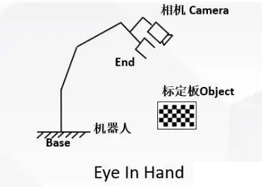


- 두 번째는 카메라를 로봇팔 외부의 특정 위치에 고정하는 구성입니다.

  ​	


## 원리

### 1. Eye-in-Hand

​		**Eye-in-Hand 구성에서 핸드-아이 캘리브레이션은 카메라와 로봇팔 말단 사이의 좌표 변환 관계를 구하는 과정입니다.**


목표점의 공간 3차원 좌표를 변환할 때 가장 먼저 필요한 것은 로봇팔 말단 좌표계와 카메라 좌표계 사이의 위치 변환 관계입니다. 이것이 로봇팔의 핸드-아이 위치 관계이자 핸드-아이 캘리브레이션으로 최종 계산하려는 결과입니다. 이 관계를 기호 X로 나타내며 방정식 AX=XB로 구할 수 있습니다. 여기서 A는 인접한 두 동작 사이의 **로봇팔 말단 변환 관계**를, B는 인접한 두 동작 사이의 **카메라 좌표계의 상대 운동**을 나타냅니다.

그림 1은 Eye-in-Hand 구성을 보여줍니다. 이 그림은 설명을 위한 예시이며 실제 실험 환경은 아닙니다. 카메라는 로봇팔 말단에 고정되어 로봇팔의 움직임에 따라 함께 움직입니다.


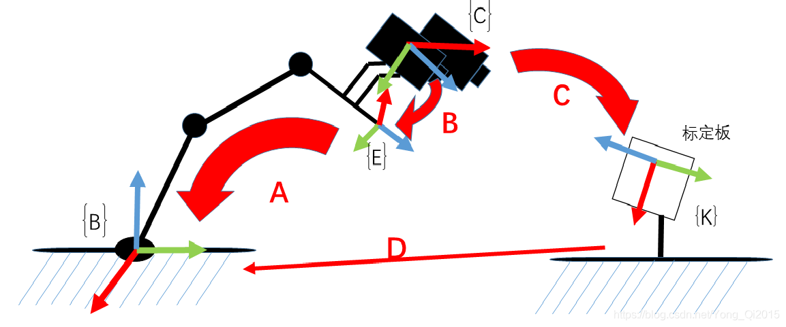

- A: 로봇팔 좌표계에서의 로봇팔 말단 자세이며, 로봇팔 API를 통해 얻습니다. (기지값)

$$ {}^{base}_{end}M $$
  
- B: 로봇 말단 좌표계에서의 카메라 자세입니다. 이 변환은 고정되어 있으므로 이 변환을 알면 언제든 카메라의 실제 위치를 계산할 수 있습니다. 따라서 이것이 구하려는 값입니다. (미지값)

$$ {}^{end}_{camera}M $$
  
- C: 캘리브레이션 보드 좌표계에서의 카메라 자세로, 카메라 외부 파라미터에 해당합니다. (카메라 캘리브레이션으로 계산)
  
$$ {}^{board}_{camera}M $$

- D: 로봇 좌표계에서의 캘리브레이션 보드 자세입니다. 캘리브레이션 중에는 로봇팔 말단만 움직이고 캘리브레이션 보드와 로봇팔 베이스는 움직이지 않으므로 이 자세 관계는 고정되어 있습니다.


$$ {}^{base}_{board}M $$

따라서 B 변환을 계산하면 로봇팔 좌표계에서의 캘리브레이션 보드 자세 D도 자연스럽게 얻을 수 있습니다.

$$ {}^{base}{board}M = {}^{base}{end}M \cdot {}^{end}{camera}M \cdot {}^{camera}{board}M $$

그림 2와 같이 로봇팔을 두 위치로 이동시키고 두 위치 모두에서 캘리브레이션 보드가 보이도록 한 뒤 공간 변환 루프를 구성합니다.

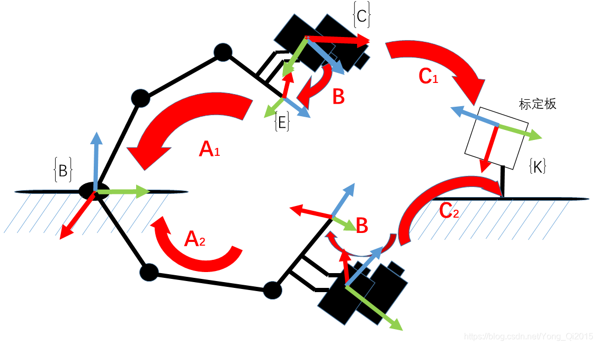

$$ A_1 \cdot B \cdot C_1^{-1} = A_2 \cdot B \cdot C_2^{-1} $$

$$ \left( A_2^{-1} \cdot A_1 \right) \cdot B = B \cdot \left( C_2^{-1} \cdot C_1 \right) $$

이는 아래 식과 같습니다.


$$ {}^{base}{end}M_1 \cdot {}^{end}{camera}M_1 \cdot {}^{camera}{board}M_1 = {}^{base}{end}M_2 \cdot {}^{end}{camera}M_2 \cdot {}^{camera}{board}M_2 $$

$$ \left( {}^{base}{end}M_2 \right)^{-1} \cdot {}^{base}{end}M_1 \cdot {}^{end}{camera}M_1 = {}^{end}{camera}M_2 \cdot {}^{camera}{board}M_2 \cdot \left( {}^{camera}{board}M_1 \right)^{-1} $$

이는 전형적인 **AX=XB** 문제이며, 정의에 따라 X는 4×4 동차 변환 행렬입니다.

$$ X = \begin{bmatrix} R & t \\\ 0 & 1 \end{bmatrix} $$

핸드-아이 캘리브레이션의 목적은 X를 계산하는 것입니다.

​	

### 2. Eye-to-Hand

### 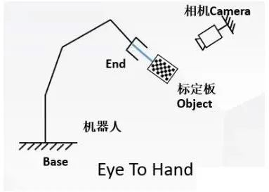

**Eye-to-Hand** 캘리브레이션에서는 **로봇팔 베이스와 카메라를 고정**하고 **캘리브레이션 보드를 로봇팔 말단에 고정**합니다. 따라서 캘리브레이션 중에는 **캘리브레이션 보드와 로봇팔 말단의 관계가 변하지 않으며, 카메라와 로봇 베이스 좌표계의 관계도 변하지 않습니다.**

캘리브레이션 목표: 카메라에서 로봇팔 베이스 좌표계로의 변환 행렬

$$ {}^{base}_{camera}M $$

수행 방법: 1. 캘리브레이션 보드를 로봇팔 말단에 고정합니다.

​					2. 로봇팔 말단을 이동하면서 서로 다른 로봇팔 자세에서 캘리브레이션 보드 이미지 n장(10~20장)을 촬영합니다.

이미지와 로봇팔 자세를 수집할 때마다 다음 등식이 성립합니다.

$$ {}^{end}{board}M = {}^{end}{base}M \cdot {}^{base}{camera}M \cdot {}^{camera}{board}M $$


여기서:

| 기호               | 설명                         |
| ------------------ | ---------------------------- |
|$$^{end}_{board}M$$  | 캘리브레이션 보드에서 로봇팔 말단으로의 변환 행렬(캘리브레이션 중 보드가 말단에 고정되어 있어 이 변환 행렬은 변하지 않음) |
|$${}^{end}_{base}M$$ | 로봇팔 말단 자세로부터 계산 가능 |
|$${}^{base}_{camera}M$$ | 핸드-아이 캘리브레이션으로 구할 값 |
|$${}^{camera}_{board}M$$ | 카메라 캘리브레이션으로 획득 |


따라서 다음 등식을 얻을 수 있습니다.

**The Cauchy-Schwarz Inequality**

$$ {}^{end}{base}M_1 \cdot {}^{base}{camera}M_1 \cdot {}^{camera}{board}M_1 = {}^{end}{base}M_2 \cdot {}^{base}{camera}M_2 \cdot {}^{camera}{board}M_2 $$

$$ {}^{end}{base}M_2^{-1} \cdot {}^{end}{base}M_1 \cdot {}^{base}{camera}M_1 = {}^{base}{camera}M_2 \cdot {}^{camera}{board}M_2 \cdot {}^{camera}{board}M_1^{-1} $$

$$ \vdots $$

$$ {}^{end}{base}M_n^{-1} \cdot {}^{end}{base}M_{n-1} \cdot {}^{base}{camera}M{n-1} = {}^{base}{camera}M_n \cdot {}^{camera}{board}M_n \cdot {}^{camera}{board}M{n-1}^{-1} $$


이 역시 전형적인 **AX=XB** 문제입니다. 정의에 따라 X는 4×4 동차 변환 행렬이며, R은 카메라에서 로봇팔 베이스 좌표계로의 회전 행렬이고 t는 카메라에서 로봇팔 베이스 좌표계로의 평행이동 벡터입니다.

$$ X = \begin{bmatrix} R & t \\\ 0 & 1 \end{bmatrix} $$

핸드-아이 캘리브레이션의 목적은 X를 계산하는 것입니다.


## 핵심 코드 설명

### 코드 구조

```
---eye_hand_data  Eye-in-Hand 캘리브레이션에서 수집한 데이터

---libs

​         ---auxiliary.py 프로그램에서 사용하는 보조 패키지

​         ---log_settings.py 로그 패키지

---robotic_arm_package 로봇팔 Python 패키지

---collect_data.py 핸드-아이 캘리브레이션 데이터 수집 프로그램

---compute_in_hand.py Eye-in-Hand 캘리브레이션 계산 프로그램

---compute_to_hand.py Eye-to-Hand 캘리브레이션 계산 프로그램

---requirements.txt 환경 의존성 파일

---save_poses.py 계산 의존성 파일

---save_poses2.py 계산 의존성 파일
```


### compute_in_hand.py | compute_to_hand.py 핵심 코드 설명

#### 1. 메인 함수 `func()`

**compute_in_hand.py | compute_to_hand.py**

```python
def func():
    
    path = os.path.dirname(__file__)

    # 서브픽셀 코너 탐색 기준
    criteria = (cv2.TERM_CRITERIA_MAX_ITER | cv2.TERM_CRITERIA_EPS, 30, 0.001)

    # 캘리브레이션 보드의 3D 점 좌표 준비
    objp = np.zeros((XX * YY, 3), np.float32)
    objp[:, :2] = np.mgrid[0:XX, 0:YY].T.reshape(-1, 2)
    objp = L * objp

    obj_points = []     # 3D 점 저장
    img_points = []     # 2D 점 저장

    images_num = [f for f in os.listdir(images_path) if f.endswith('.jpg')]

    for i in range(1, len(images_num) + 1):
        image_file = os.path.join(images_path, f"{i}.jpg")

        if os.path.exists(image_file):
            logger_.info(f'읽기 {image_file}')

            img = cv2.imread(image_file)
            gray = cv2.cvtColor(img, cv2.COLOR_BGR2GRAY)

            size = gray.shape[::-1]
            ret, corners = cv2.findChessboardCorners(gray, (XX, YY), None)

            if ret:
                obj_points.append(objp)
                corners2 = cv2.cornerSubPix(gray, corners, (5, 5), (-1, -1), criteria)
                if [corners2]:
                    img_points.append(corners2)
                else:
                    img_points.append(corners)

```


위 코드는 수집한 캘리브레이션 보드 이미지를 순회하면서 체스보드 코너를 하나씩 검출해 배열에 저장합니다.

#### 2. 카메라 캘리브레이션

**compute_in_hand.py | compute_to_hand.py**

```python


# 캘리브레이션을 수행하여 카메라 좌표계에서 패턴의 자세를 구함
ret, mtx, dist, rvecs, tvecs = cv2.calibrateCamera(obj_points, img_points, size, None, None)

```


- OpenCV의 `calibrateCamera` 함수로 카메라 캘리브레이션을 수행하여 카메라 내부 파라미터와 왜곡 계수를 계산합니다.

- `rvecs`와 `tvecs`는 각각 이미지별 회전 벡터와 평행이동 벡터이며, **카메라 좌표계에서의 캘리브레이션 보드 자세**를 나타냅니다.

  

#### 3. 로봇팔 자세 데이터 처리

**compute_in_hand.py**

```python
poses_main(file_path)
```

로봇팔 말단 자세 데이터를 **베이스 좌표계**에 대한 **로봇팔 말단 좌표계**의 회전 행렬과 평행이동 벡터로 변환합니다.

**compute_to_hand.py**

```python
poses2_main(file_path)
```

로봇팔 말단 자세 데이터를 **로봇팔 말단 좌표계**에 대한 **베이스 좌표계**의 회전 행렬과 평행이동 벡터로 변환합니다.


#### 4. 핸드-아이 캘리브레이션 계산

```python
R, t = cv2.calibrateHandEye(R_tool, t_tool, rvecs, tvecs, cv2.CALIB_HAND_EYE_TSAI)

return R,t

```

- OpenCV의 `calibrateHandEye` 함수로 핸드-아이 캘리브레이션을 수행합니다.

  - compute_in_hand.py에서는 **로봇팔 말단**에 대한 **카메라**의 회전 행렬 **R_cam2end**와 평행이동 벡터 **T_cam2end**를 계산합니다.

    ```
    void
    cv::calibrateHandEye(InputArrayOfArrays 	R_end2base,
                         InputArrayOfArrays 	T_end2base, 
                         InputArrayOfArrays 	R_board2cam,
                         InputArrayOfArrays 	T_board2cam,
                         OutputArray 	        R_cam2end,
                         OutputArray 	        T_cam2end, 
                         HandEyeCalibrationMethod method = CALIB_HAND_EYE_TSAI)	
    
    ```

    

  - compute_to_hand.py에서는 **로봇팔 베이스**에 대한 **카메라**의 회전 행렬 **R_cam2base**와 평행이동 벡터 **T_cam2base**를 계산합니다.

    ```
    void
    cv::calibrateHandEye(InputArrayOfArrays 	R_base2end
                         InputArrayOfArrays 	T_base2end
                         InputArrayOfArrays 	R_board2cam
                         InputArrayOfArrays 	T_board2cam
                         OutputArray 	        R_cam2base
                         OutputArray 	        T_cam2base
                         HandEyeCalibrationMethod method = CALIB_HAND_EYE_TSAI)	
    
    ```

    

- 일반적으로 많이 사용하는 핸드-아이 캘리브레이션 알고리즘인 `CALIB_HAND_EYE_TSAI` 방법을 사용합니다.


### `save_poses.py` 핵심 코드 설명

#### 1. **오일러 각을 회전 행렬로 변환하는 함수 정의**

```python
def euler_angles_to_rotation_matrix(rx, ry, rz):
    # 회전 행렬 계산
    Rx = np.array([[1, 0, 0],
                   [0, np.cos(rx), -np.sin(rx)],
                   [0, np.sin(rx), np.cos(rx)]])

    Ry = np.array([[np.cos(ry), 0, np.sin(ry)],
                   [0, 1, 0],
                   [-np.sin(ry), 0, np.cos(ry)]])

    Rz = np.array([[np.cos(rz), -np.sin(rz), 0],
                   [np.sin(rz), np.cos(rz), 0],
                   [0, 0, 1]])

    R = Rz @ Ry @ Rx

    return R

```

- 오일러 각(X, Y, Z축 주위의 회전)을 회전 행렬로 변환하는 함수를 정의합니다.
- Z-Y-X 순서로 회전하고 각 축의 회전 행렬을 곱하여 최종 회전 행렬 `R`을 구합니다.

#### 2. **자세를 동차 변환 행렬로 변환**

```python
def pose_to_homogeneous_matrix(pose):
    x, y, z, rx, ry, rz = pose
    R = euler_angles_to_rotation_matrix(rx, ry, rz)
    t = np.array([x, y, z]).reshape(3, 1)

    H = np.eye(4)
    H[:3, :3] = R
    H[:3, 3] = t[:, 0]

    return H

```

- 자세(위치 및 방향)를 행렬 연산에 사용할 수 있도록 4×4 동차 변환 행렬로 변환합니다.
- 위치 `(x, y, z)`는 평행이동 벡터로, 방향 `(rx, ry, rz)`는 회전 오일러 각으로 사용합니다.
- 생성된 동차 변환 행렬 `H`는 **베이스에 대한 로봇팔 말단의 회전 변환**을 나타내는 데 사용됩니다.

#### 3. **여러 행렬을 CSV 파일에 저장**

```python
Copy codedef save_matrices_to_csv(matrices, file_name):
    rows, cols = matrices[0].shape
    num_matrices = len(matrices)
    combined_matrix = np.zeros((rows, cols * num_matrices))

    for i, matrix in enumerate(matrices):
        combined_matrix[:, i * cols: (i + 1) * cols] = matrix

    with open(file_name, 'w', newline='') as csvfile:
        csv_writer = csv.writer(csvfile)
        for row in combined_matrix:
            csv_writer.writerow(row)
```

- 여러 행렬을 가로로 이어 붙여 하나의 큰 행렬로 만든 뒤 CSV 파일에 저장합니다.

- 각 행렬이 고정된 수의 열을 차지하므로, 읽을 때 일정한 간격으로 나누어 개별 행렬을 추출할 수 있습니다.

  

## 캘리브레이션 과정

### 1. 환경 요구 사항

#### 기본 환경 준비

| 항목     | 버전           |
| :------- | :------------- |
| 운영체제 | ubuntu/windows |
| Python   | 3.9 이상       |
|          |                |

#### Python 환경 준비

| 패키지        | 버전        |
| :------------ | :---------- |
| numpy         | 2.0.2       |
| opencv-python | 4.10.0.84   |
| pyrealsense2  | 2.55.1.6486 |
| scipy         | 1.13.1      |

아래 명령을 실행하여 Python 환경에 핸드-아이 캘리브레이션 프로그램에 필요한 패키지를 설치합니다.

```cmd
pip install -r requirements.txt
```


#### 장비 준비

- 로봇팔: RM75 RM65 RM63 GEN72
- 카메라: Intel RealSense Depth Camera D435

- 카메라 전용 데이터 케이블

- 이더넷 케이블

- 캘리브레이션 보드(1 또는 2)

  1. 종이 캘리브레이션 보드 인쇄

     .png)

  2. 타오바오에서 “캘리브레이션 체스보드”를 검색하여 구매


### 2. 캘리브레이션 과정

#### 파라미터 설정

설정 파일(`config.yaml`)에서 캘리브레이션 보드 파라미터를 설정합니다.

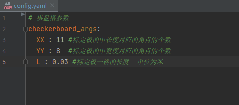

​		

config.yaml에는 다음 세 가지 설정 파라미터가 있습니다.

​        xx: 캘리브레이션 보드의 가로 방향 내부 코너 수(긴 변의 사각형 수 - 1)입니다. 기본값은 11이며, 예를 들어 아래 그림처럼 긴 변에 사각형이 12개라면 코너 수는 11입니다.

​		YY: 캘리브레이션 보드의 세로 방향 내부 코너 수(짧은 변의 사각형 수 - 1)입니다. 기본값은 8이며, 예를 들어 아래 그림처럼 짧은 변에 사각형이 9개라면 코너 수는 8입니다.

​		L: 캘리브레이션 보드 한 칸의 실제 크기(단위: m)이며, 기본값은 0.03입니다.

​        


#### Eye-in-Hand

##### 데이터 수집

(1). 카메라 연결 케이블로 **컴퓨터**와 D435 카메라를 연결하고, 이더넷 케이블로 **컴퓨터**와 로봇팔을 연결합니다.

(2). 컴퓨터와 로봇팔의 IP를 동일한 네트워크 대역으로 설정합니다.

로봇팔 IP가 192.168.1.18이면 컴퓨터 IP 주소를 1번 대역으로 설정합니다.

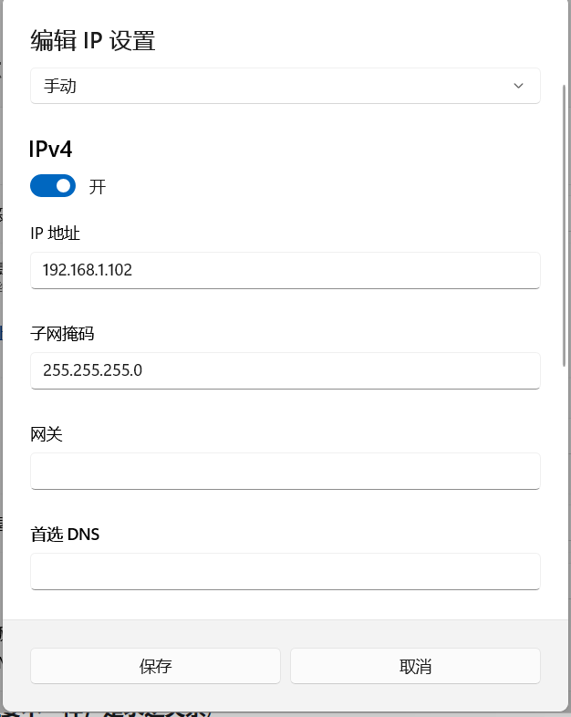

​			로봇팔 IP가 192.168.10.18이면 컴퓨터 IP를 10번 대역으로 설정합니다(위 설정 참고).

(3). 캘리브레이션 보드를 평면 위에 놓고 카메라를 로봇팔 말단에 고정한 뒤, 카메라가 캘리브레이션 보드를 향하도록 합니다.

​		캘리브레이션 중에는 캘리브레이션 보드를 로봇팔 작업 영역 안에 **고정하여 배치**합니다. 이 위치는 **로봇팔 말단에 장착된 카메라가 서로 다른 시점에서** 보드를 관측할 수 있어야 합니다. 로봇팔 베이스에 대한 보드의 자세를 알 필요가 없으므로 정확한 설치 위치는 중요하지 않습니다. 하지만 캘리브레이션 중에는 보드가 **고정된 상태를 유지해야 하며 움직여서는 안 됩니다.**

(4). `collect_data.py` 스크립트를 실행하면 팝업 창이 나타납니다.

(5). 로봇팔 말단을 움직여 카메라 시야에 캘리브레이션 보드가 선명하고 완전하게 보이도록 한 뒤 커서를 팝업 창 위에 놓습니다.

​		**주의:**

- 카메라 시야에 보이는 **캘리브레이션 보드**와 **카메라 렌즈 면**이 **일정한 각도**를 이루도록 합니다.

  

  아래 촬영 자세는 **잘못된 자세**입니다.
  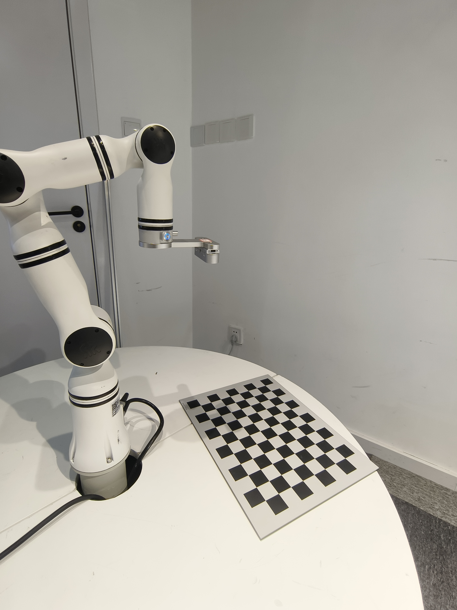

​				

(6). 키보드의 “s”를 눌러 데이터를 수집합니다.

(7). 로봇팔을 15~20회 이동하면서 (5), (6)단계를 반복하여 서로 다른 로봇팔 자세에서 캘리브레이션 보드 이미지 약 15~20장을 수집합니다.

​	**주의:**

​			**로봇팔 말단 회전축**을 움직이며, 매번 가능한 한 큰 각도(30° 초과)로 회전합니다.

​			세 축(X, Y, Z) 모두에서 회전 각도가 충분히 변하도록 합니다.

​			(먼저 로봇팔 말단의 z축을 기준으로 여러 각도로 회전하며 이미지를 여러 장 촬영한 뒤, x축을 기준으로 회전할 수 있습니다.)

​			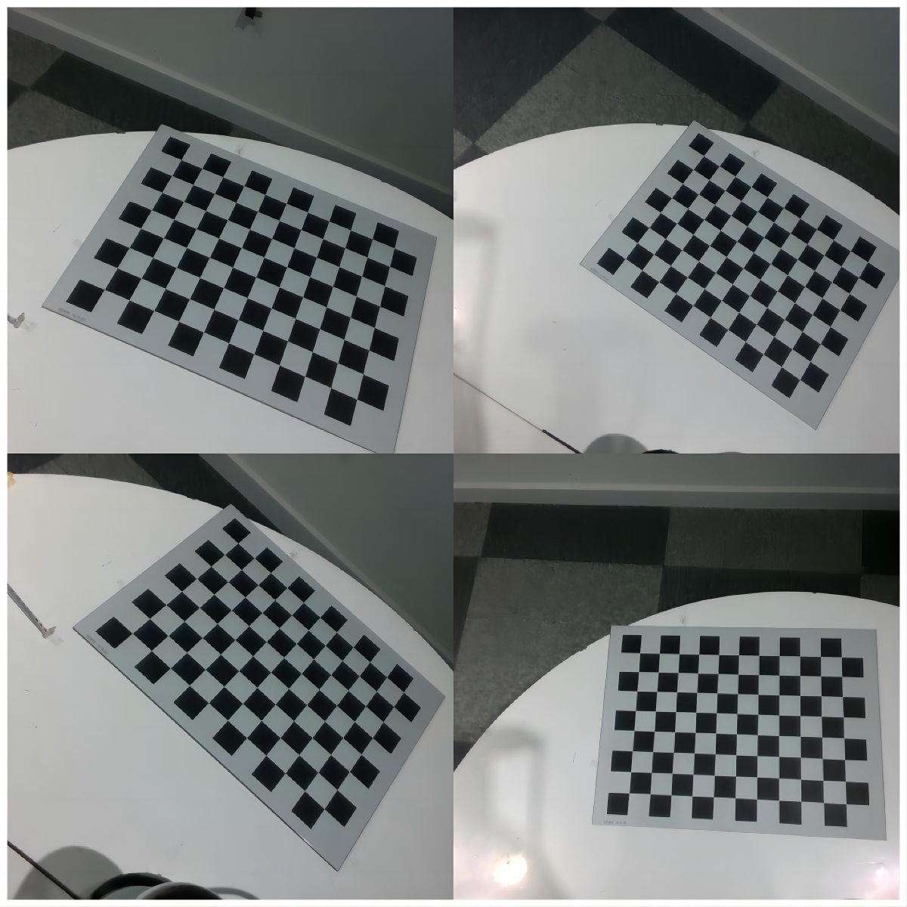

##### 캘리브레이션 결과 계산

​		`compute_in_hand.py` 스크립트를 실행하여 캘리브레이션 결과를 얻습니다.

​        **로봇팔 말단 좌표계**에 대한 **카메라 좌표계**의 **회전 행렬**과 **평행이동 벡터**를 얻습니다.

#### Eye-to-Hand

##### 데이터 수집

(1). 카메라 연결 케이블로 **컴퓨터**와 D435 카메라를 연결하고, 이더넷 케이블로 **컴퓨터**와 로봇팔을 연결합니다.

(2). 컴퓨터와 로봇팔의 IP를 동일한 네트워크 대역으로 설정합니다.

​	로봇팔 IP가 192.168.1.18이면 컴퓨터 IP 주소를 1번 대역으로 설정합니다.

​    로봇팔 IP가 192.168.10.18이면 컴퓨터 IP를 10번 대역으로 설정합니다.

(3). 캘리브레이션 보드(**고정하기 쉽도록 작은 크기로 종이에 인쇄한 보드**)를 **로봇팔 말단에 고정하고 카메라는 움직이지 않도록 고정**합니다. 로봇팔 말단을 움직여 캘리브레이션 보드가 카메라 시야에 들어오도록 합니다.

​       캘리브레이션 중 보드는 **로봇팔 말단장치에 장착**되어 로봇팔과 함께 움직입니다. 툴 플랜지에 직접 고정하거나 지그로 고정할 수 있습니다. **캘리브레이션 보드와 말단장치**의 상대 자세를 알 필요가 없으므로 정확한 장착 위치는 중요하지 않습니다. 중요한 것은 움직이는 동안 보드가 **툴 플랜지 또는 지그에 대해 변위되지 않는 것**입니다. 보드를 단단히 고정하거나 지그로 견고하게 파지해야 하며, 강성 재질의 장착 브래킷 사용을 권장합니다.

(4). `collect_data.py` 스크립트를 실행하면 팝업 창이 나타납니다.

(5). 로봇팔 말단을 움직여 카메라 시야에 캘리브레이션 보드가 선명하고 완전하게 보이도록 한 뒤 커서를 팝업 창 위에 놓습니다.

​		**주의:**

​				카메라 시야에 보이는 캘리브레이션 보드와 카메라 렌즈 면이 일정한 각도를 이루도록 합니다.

(6). 키보드의 “s”를 눌러 데이터를 수집합니다.

(7). 로봇팔을 15~20회 이동하면서 (5), (6)단계를 반복하여 서로 다른 로봇팔 자세에서 캘리브레이션 보드 이미지 약 15~20장을 수집합니다.

​			**로봇팔 말단 회전축**을 움직이며, 매번 가능한 한 큰 각도(30° 초과)로 회전합니다.

​			세 축(X, Y, Z) 모두에서 회전 각도가 충분히 변하도록 합니다.


##### 캘리브레이션 결과 계산

`compute_to_hand.py` 스크립트를 실행하여 캘리브레이션 결과를 얻습니다.

**로봇팔 베이스 좌표계**에 대한 **카메라 좌표계**의 **회전 행렬**과 **평행이동 벡터**를 얻습니다.


**평행이동 벡터**의 단위는 미터(m)입니다.


#### 오차 범위

수집한 이미지의 품질에 따라 달라질 수 있지만, 캘리브레이션 결과의 평행이동 벡터와 실제 값의 차이는 1cm 이내입니다.

## 캘리브레이션 중 발생할 수 있는 문제

### 문제 1

수집한 데이터를 계산할 때,

즉 아래 스크립트를 실행할 때,

```cmd
python compute_in_hand.py
```

또는

```python
python compute_to_hand.py
```

다음 문제가 발생할 수 있습니다.

문제 설명: [ERROR:0@1.418] global calibration_handeye.cpp:335 calibrateHandEyeTsai Hand-eye calibration failed! Not enough informative motions--include larger rotations.


**문제 원인**: 수집한 이미지의 회전량이 부족하며, 특히 충분히 큰 회전 운동이 포함되지 않았습니다.

핸드-아이 캘리브레이션은 로봇이 공간에서 일련의 운동을 수행해야 카메라와 로봇 말단 사이의 정확한 관계를 구할 수 있습니다. 로봇 운동 데이터에 충분한 회전 변화가 없거나, 특히 각 축 방향으로 뚜렷한 회전이 부족하면 캘리브레이션 알고리즘이 핸드-아이 관계를 정확하게 계산할 수 없습니다.


**해결 방법:**

1. **회전 운동 늘리기:**

- 데이터 수집 중 로봇이 더 큰 회전 운동을 수행하도록 합니다. 세 축(X, Y, Z) 모두에서 회전 각도가 충분히 변하도록 합니다.
- 예를 들어 회전 각도를 30도보다 크게 하면 더 풍부한 운동 정보를 제공할 수 있습니다.

2. **운동 자세 다양화:**

- 데이터를 수집할 때 로봇 말단이 평행이동과 회전을 포함한 다양한 자세 변화를 수행하도록 합니다.
- 좁은 범위에서만 움직이거나 한 축으로만 움직이지 않도록 합니다.

3. **데이터 수집 횟수 늘리기:**

- 더 많은 샘플 데이터를 수집합니다. 일반적으로 서로 다른 자세 데이터가 최소 10세트 이상 필요합니다.
- 데이터가 많을수록 캘리브레이션의 안정성과 정확도를 높일 수 있습니다.

## 핸드-아이 캘리브레이션 결과 사용 방법


로봇팔은 물체를 어떻게 집을까요?

### Eye-in-Hand

#### 이론

먼저 **카메라를 고려하지 않은** 로봇팔부터 살펴봅니다. 두 가지 주요 좌표계는 다음과 같습니다.

​	1. 로봇팔 베이스 좌표계

   2. 말단장치 좌표계

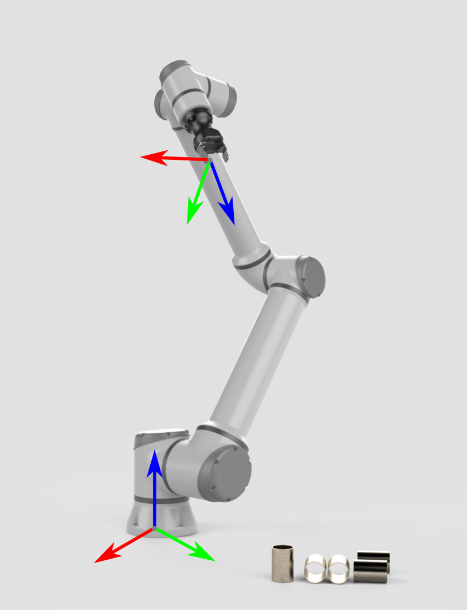


물체를 집으려면 로봇팔은 **로봇팔 베이스 좌표계에 대한 물체의 자세**를 알아야 합니다. 이 정보와 로봇의 기구학 정보를 이용하면 말단장치/그리퍼가 물체 쪽으로 이동하기 위한 관절 각도를 계산할 수 있습니다.

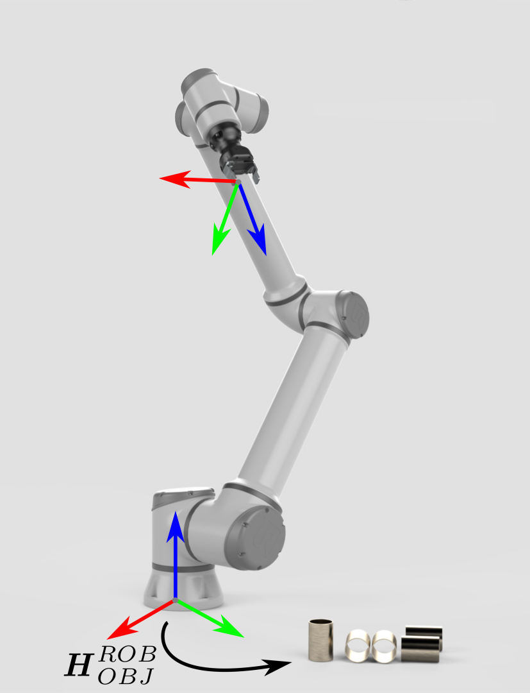

**카메라 좌표계에 대한 물체의 자세**는 **모델 인식**을 통해 얻을 수 있습니다. 로봇팔이 물체를 집으려면 물체의 자세를 **카메라 좌표계**에서 **로봇팔 베이스 좌표계**로 변환해야 합니다.


이 경우 좌표 변환은 간접적으로 수행됩니다.

$$ H^{ROB}{OBJ} = H^{ROB}{EE} \cdot H^{EE}{CAM} \cdot H^{CAM}{OBJ} $$

로봇팔 베이스에 대한 말단장치의 자세

$$H^{ROB}_{EE}$$

는 기지값이며 로봇팔 API를 통해 얻을 수 있습니다. 말단장치에 대한 카메라의 자세

$$H^{EE}_{CAM}$$

는 핸드-아이 캘리브레이션을 통해 얻습니다.


카메라 좌표계에서 물체가 하나의 3D 점 또는 하나의 자세로 표현된다고 가정하면, 아래에서는 물체 위치를 3D 점 또는 자세로서 **카메라 좌표계에서 로봇팔 베이스 좌표계로 변환**하는 수학적 원리를 설명합니다.

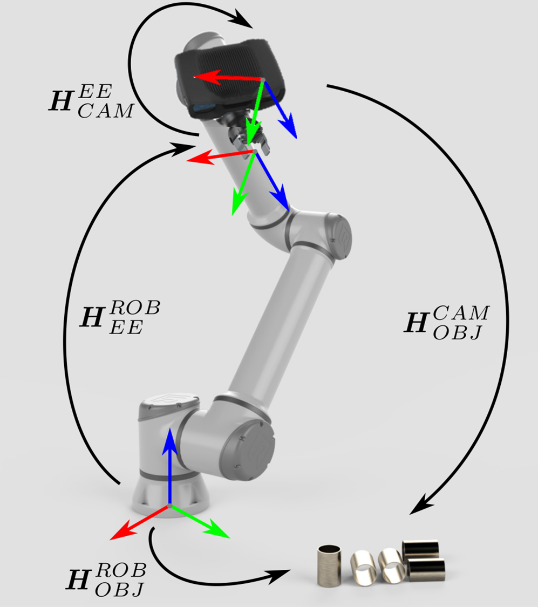

로봇팔의 자세는 동차 변환 행렬로 나타냅니다.

다음 방정식은 하나의 3D 점을 카메라 좌표계에서 로봇팔 베이스 좌표계로 변환하는 방법을 나타냅니다.

$$ p^{ROB} = H^{ROB}{EE} \cdot H^{EE}{CAM} \cdot p^{CAM} $$

$$ \begin{bmatrix} x^r \\\ y^r \\\ z^r \\\ 1 \end{bmatrix} = \begin{bmatrix} R_e^r & t_e^r \\\ 0 & 1 \end{bmatrix} \cdot \begin{bmatrix} R_c^e & t_c^e \\\ 0 & 1 \end{bmatrix} \cdot \begin{bmatrix} x^c \\\ y^c \\\ z^c \\\ 1 \end{bmatrix} $$

물체 자세를 카메라 좌표계에서 로봇팔 베이스 좌표계로 변환하려면 다음과 같이 계산합니다.

$$ H^{ROB}{OBJ} = H^{ROB}{EE} \cdot H^{EE} {CAM} \cdot H^{CAM} {OBJ} $$

$$ \begin{bmatrix} R_o^r & t_o^r \\\ 0 & 1 \end{bmatrix} = \begin{bmatrix} R_e^r & t_e^r \\\ 0 & 1 \end{bmatrix} \cdot \begin{bmatrix} R_c^e & t_c^e \\\ 0 & 1 \end{bmatrix} \cdot \begin{bmatrix} R_o^c & t_o^c \\\ 0 & 1 \end{bmatrix} $$


​	이렇게 얻은 자세는 물체를 집기 위해 로봇팔의 현재 툴 좌표계 원점이 도달해야 하는 자세입니다. (캘리브레이션 중 수집한 로봇팔 자세 역시 로봇팔 베이스 좌표계에 대한 현재 툴 좌표계의 자세입니다.)


#### 코드


- 카메라 좌표계에서 물체가 하나의 3D 점 `(x, y, z)`인 경우

  ```python
  
  import numpy as np
  from scipy.spatial.transform import Rotation as R
  
  
  # 카메라 좌표계에서 로봇팔 말단 좌표계로의 회전 행렬과 평행이동 벡터(핸드-아이 캘리브레이션으로 획득)
  rotation_matrix = np.array([[-0.00235395 , 0.99988123 ,-0.01523124],
                              [-0.99998543, -0.00227965, 0.0048937],
                              [0.00485839, 0.01524254, 0.99987202]])
  translation_vector = np.array([-0.09321419, 0.03625434, 0.02420657])
  
  
  def convert(x ,y ,z ,x1 ,y1 ,z1 ,rx ,ry ,rz):
      """
      핸드-아이 캘리브레이션으로 얻은 회전 행렬과 평행이동 벡터를 동차 변환 행렬로 변환한 뒤,
      깊이 카메라로 인식한 물체 좌표(x, y, z)와 로봇팔 말단 자세(x1, y1, z1, rx, ry, rz)를 사용하여
      로봇팔 베이스에 대한 물체의 위치(x, y, z)를 계산합니다.
  
      """
  
  
  
      # 깊이 카메라가 물체를 인식하여 반환한 좌표
      obj_camera_coordinates = np.array([x, y, z])
  
      # 로봇팔 말단의 자세, 단위는 라디안
      end_effector_pose = np.array([x1, y1, z1,
                                    rx, ry, rz])
  
      # 회전 행렬과 평행이동 벡터를 동차 변환 행렬로 변환
      T_camera_to_end_effector = np.eye(4)
      T_camera_to_end_effector[:3, :3] = rotation_matrix
      T_camera_to_end_effector[:3, 3] = translation_vector
  
      # 로봇팔 말단 자세를 동차 변환 행렬로 변환
      position = end_effector_pose[:3]
      orientation = R.from_euler('xyz', end_effector_pose[3:], degrees=False).as_matrix()
  
      T_base_to_end_effector = np.eye(4)
      T_base_to_end_effector[:3, :3] = orientation
      T_base_to_end_effector[:3, 3] = position
  
      # 로봇팔 베이스에 대한 물체의 위치 계산
      obj_camera_coordinates_homo = np.append(obj_camera_coordinates, [1])  # 물체 좌표를 동차 좌표로 변환
  
      obj_end_effector_coordinates_homo = T_camera_to_end_effector.dot(obj_camera_coordinates_homo)
  
      obj_base_coordinates_homo = T_base_to_end_effector.dot(obj_end_effector_coordinates_homo)
  
      obj_base_coordinates = list(obj_base_coordinates_homo[:3])  # 동차 좌표에서 물체의 x, y, z 좌표 추출
  
  
      return obj_base_coordinates
  
  
  ```

  

- 카메라 좌표계에서 물체가 하나의 자세로 표현되는 경우

  ```python
  
  import numpy as np
  from scipy.spatial.transform import Rotation as R
  
  
  # 카메라 좌표계에서 로봇팔 말단 좌표계로의 회전 행렬과 평행이동 벡터(핸드-아이 캘리브레이션으로 획득)
  rotation_matrix = np.array([[-0.00235395 , 0.99988123 ,-0.01523124],
                              [-0.99998543, -0.00227965, 0.0048937],
                              [0.00485839, 0.01524254, 0.99987202]])
  translation_vector = np.array([-0.09321419, 0.03625434, 0.02420657])
  
  
  def decompose_transform(matrix):
      """
      행렬을 자세로 변환합니다.
      """
  
      translation = matrix[:3, 3]
      rotation = matrix[:3, :3]
  
      # Convert rotation matrix to euler angles (rx, ry, rz)
      sy = np.sqrt(rotation[0, 0] * rotation[0, 0] + rotation[1, 0] * rotation[1, 0])
      singular = sy < 1e-6
  
      if not singular:
          rx = np.arctan2(rotation[2, 1], rotation[2, 2])
          ry = np.arctan2(-rotation[2, 0], sy)
          rz = np.arctan2(rotation[1, 0], rotation[0, 0])
      else:
          rx = np.arctan2(-rotation[1, 2], rotation[1, 1])
          ry = np.arctan2(-rotation[2, 0], sy)
          rz = 0
  
      return translation, rx, ry, rz
  
  
  def convert(x,y,z,rx,ry,rz,x1,y1,z1,rx1,ry1,rz1):
  
      """
  
      캘리브레이션으로 얻은 회전 행렬과 평행이동 벡터를 동차 변환 행렬로 변환한 뒤,
      로봇팔 말단 자세(x, y, z, rx, ry, rz)와 깊이 카메라로 인식한 물체 자세
      (x1, y1, z1, rx1, ry1, rz1)를 사용하여 로봇팔 베이스에 대한 물체의 자세를 계산합니다.
  
      """
  
  
  
      # 깊이 카메라가 물체를 인식하여 반환한 자세
      obj_camera_coordinates = np.array([x1, y1, z1,rx1,ry1,rz1])
  
      # 로봇팔 말단의 자세, 단위는 라디안
      end_effector_pose = np.array([x, y, z,
                                    rx, ry, rz])
  
      # 회전 행렬과 평행이동 벡터를 동차 변환 행렬로 변환
      T_camera_to_end_effector = np.eye(4)
      T_camera_to_end_effector[:3, :3] = rotation_matrix
      T_camera_to_end_effector[:3, 3] = translation_vector
  
      # 로봇팔 말단 자세를 동차 변환 행렬로 변환
      position = end_effector_pose[:3]
      orientation = R.from_euler('xyz', end_effector_pose[3:], degrees=False).as_matrix()
  
      T_end_to_base_effector = np.eye(4)
      T_end_to_base_effector[:3, :3] = orientation
      T_end_to_base_effector[:3, 3] = position
  
      # 로봇팔 베이스에 대한 물체의 자세 계산
  
  
      # 카메라에 대한 물체의 자세를 동차 변환 행렬로 변환
      position2 = obj_camera_coordinates[:3]
      orientation2 = R.from_euler('xyz', obj_camera_coordinates[3:], degrees=False).as_matrix()
  
      T_object_to_camera_effector = np.eye(4)
      T_object_to_camera_effector[:3, :3] = orientation2
      T_object_to_camera_effector[:3, 3] = position2
  
  
      obj_end_effector_coordinates_homo = T_camera_to_end_effector.dot(T_object_to_camera_effector)
  
      obj_base_effector = T_end_to_base_effector.dot(obj_end_effector_coordinates_homo)
  
      result = decompose_transform(obj_base_effector)
  
  
  
      return result
  
  
  
  ```
  
  

​		   코드의 `rotation_matrix`와 `translation_vector` 변수는 각각 Eye-in-Hand **핸드-아이 캘리브레이션**으로 얻은 **회전 행렬**과 **평행이동 벡터**입니다.

### Eye-to-Hand

#### 이론

카메라는 모델을 통해 카메라 좌표계에서 물체의 자세를 얻을 수 있습니다. **로봇팔에 대한 물체의 자세**는 로봇팔 베이스 좌표계에 대한 카메라의 자세와 카메라 좌표계에 대한 물체의 자세를 오른쪽에서부터 곱하여 계산합니다.

$$ H^{ROB}{OBJ} = H^{ROB}{CAM} \cdot H^{CAM}{OBJ} $$

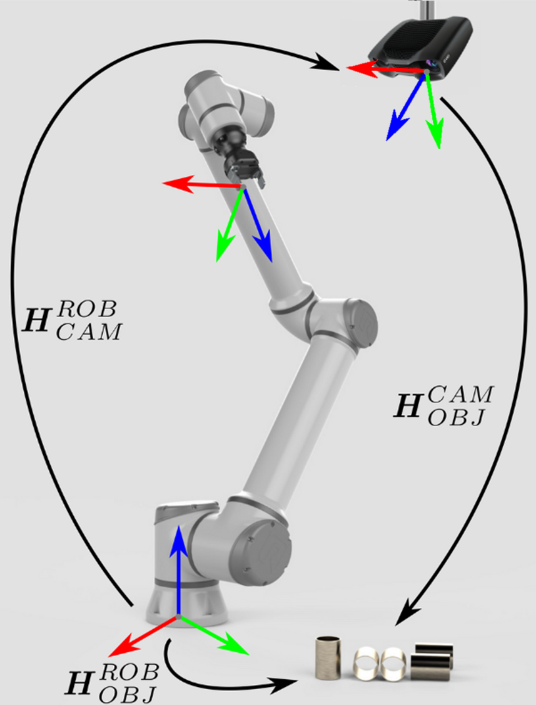


물체 위치가 하나의 3D 점 또는 하나의 자세로 표현된다고 가정하면, 아래에서는 물체 위치를 3D 점 또는 자세로서 **카메라 좌표계에서 로봇팔 베이스 좌표계로 변환**하는 수학적 원리를 설명합니다.

다음 방정식은 하나의 3D 점을 카메라 좌표계에서 로봇팔 베이스 좌표계로 변환하는 방법을 나타냅니다.

$$ p^{ROB} = H^{ROB}{CAM} \cdot p^{CAM} $$

$$ \begin{bmatrix} x^r \\\ y^r \\\ z^r \\\ 1 \end{bmatrix} = \begin{bmatrix} R_c^r & t_c^r \\\ 0 & 1 \end{bmatrix} \cdot \begin{bmatrix} x^c \\\ y^c \\\ z^c \ 1 \end{bmatrix} $$

물체 자세를 카메라 좌표계에서 로봇팔 베이스 좌표계로 변환하려면 다음과 같이 계산합니다.

$$ H^{ROB}{OBJ} = H^{ROB}{CAM} \cdot H^{CAM}{OBJ} $$

$$ \begin{bmatrix} R_o^r & t_o^r \\\ 0 & 1 \end{bmatrix} = \begin{bmatrix} R_c^r & t_c^r \\\ 0 & 1 \end{bmatrix} \cdot \begin{bmatrix} R_o^c & t_o^c \\\ 0 & 1 \end{bmatrix} $$

#### 코드

- 카메라 좌표계에서 물체가 하나의 3D 점 `(x, y, z)`인 경우

  ```python
  
  import numpy as np
  
  
  
  # 카메라 좌표계에서 로봇팔 베이스 좌표계로의 회전 행렬과 평행이동 벡터(핸드-아이 캘리브레이션으로 획득)
  rotation_matrix = np.array([[-0.00235395 , 0.99988123 ,-0.01523124],
                              [-0.99998543, -0.00227965, 0.0048937],
                              [0.00485839, 0.01524254, 0.99987202]])
  translation_vector = np.array([-0.09321419, 0.03625434, 0.02420657])
  
  def convert(x ,y ,z):
      """
      회전 행렬과 평행이동 벡터를 동차 변환 행렬로 변환한 뒤,
      깊이 카메라로 인식한 물체 좌표(x, y, z)와 캘리브레이션으로 구한 카메라-베이스 동차 변환 행렬을 사용하여
      로봇팔 베이스에 대한 물체의 위치(x, y, z)를 계산합니다.
  
      """
  
  
  
      # 깊이 카메라가 물체를 인식하여 반환한 좌표
      obj_camera_coordinates = np.array([x, y, z])
  
  
      # 회전 행렬과 평행이동 벡터를 동차 변환 행렬로 변환
      T_camera_to_base_effector = np.eye(4)
      T_camera_to_base_effector[:3, :3] = rotation_matrix
      T_camera_to_base_effector[:3, 3] = translation_vector
  
  
  
      # 로봇팔 베이스에 대한 물체의 위치 계산
      obj_camera_coordinates_homo = np.append(obj_camera_coordinates, [1])  # 물체 좌표를 동차 좌표로 변환
  
      obj_base_effector_coordinates_homo = T_camera_to_base_effector.dot(obj_camera_coordinates_homo)
      obj_base_coordinates = obj_base_effector_coordinates_homo[:3]  # 동차 좌표에서 물체의 x, y, z 좌표 추출
  
  
      # 결과 조합
  
      return list(obj_base_coordinates)
  
  
  
  ```

  

- 카메라 좌표계에서 물체가 하나의 자세로 표현되는 경우

  ```python
  
  import numpy as np
  from scipy.spatial.transform import Rotation as R
  
  
  # 카메라 좌표계에서 로봇팔 베이스 좌표계로의 회전 행렬과 평행이동 벡터(핸드-아이 캘리브레이션으로 획득)
  rotation_matrix = np.array([[-0.00235395 , 0.99988123 ,-0.01523124],
                              [-0.99998543, -0.00227965, 0.0048937],
                              [0.00485839, 0.01524254, 0.99987202]])
  translation_vector = np.array([-0.09321419, 0.03625434, 0.02420657])
  
  def decompose_transform(matrix):
      """
      행렬을 자세로 변환합니다.
      """
  
      translation = matrix[:3, 3]
      rotation = matrix[:3, :3]
  
      # Convert rotation matrix to euler angles (rx, ry, rz)
      sy = np.sqrt(rotation[0, 0] * rotation[0, 0] + rotation[1, 0] * rotation[1, 0])
      singular = sy < 1e-6
  
      if not singular:
          rx = np.arctan2(rotation[2, 1], rotation[2, 2])
          ry = np.arctan2(-rotation[2, 0], sy)
          rz = np.arctan2(rotation[1, 0], rotation[0, 0])
      else:
          rx = np.arctan2(-rotation[1, 2], rotation[1, 1])
          ry = np.arctan2(-rotation[2, 0], sy)
          rz = 0
  
      return translation, rx, ry, rz
  
  
  
  def convert(x ,y ,z,rx,ry,rz):
      """
      회전 행렬과 평행이동 벡터를 동차 변환 행렬로 변환한 뒤,
      깊이 카메라로 인식한 물체 자세(x, y, z, rx, ry, rz)와 캘리브레이션으로 구한 카메라-베이스 동차 변환 행렬을 사용하여
      로봇팔 베이스에 대한 물체의 자세(x, y, z, rx, ry, rz)를 계산합니다.
  
      """
  
  
  
      # 깊이 카메라가 물체를 인식하여 반환한 자세
      obj_camera_coordinates = np.array([x, y, z,rx,ry,rz])
  
  
      # 회전 행렬과 평행이동 벡터를 동차 변환 행렬로 변환
      T_camera_to_base_effector = np.eye(4)
      T_camera_to_base_effector[:3, :3] = rotation_matrix
      T_camera_to_base_effector[:3, 3] = translation_vector
  
  
  
      # 로봇팔 베이스에 대한 물체의 자세 계산
      # 카메라에 대한 물체의 자세를 동차 변환 행렬로 변환
      position2 = obj_camera_coordinates[:3]
      orientation2 = R.from_euler('xyz', obj_camera_coordinates[3:], degrees=False).as_matrix()
  
      T_object_to_camera_effector = np.eye(4)
      T_object_to_camera_effector[:3, :3] = orientation2
      T_object_to_camera_effector[:3, 3] = position2
  
      obj_base_effector = T_camera_to_base_effector.dot(T_object_to_camera_effector)
  
  	result = decompose_transform(obj_base_effector)
  
      # 결과 조합
  
      return result
  
  ```

​		코드의 `rotation_matrix`와 `translation_vector` 변수는 각각 Eye-to-Hand **핸드-아이 캘리브레이션**으로 얻은 **회전 행렬**과 **평행이동 벡터**입니다.

### 
